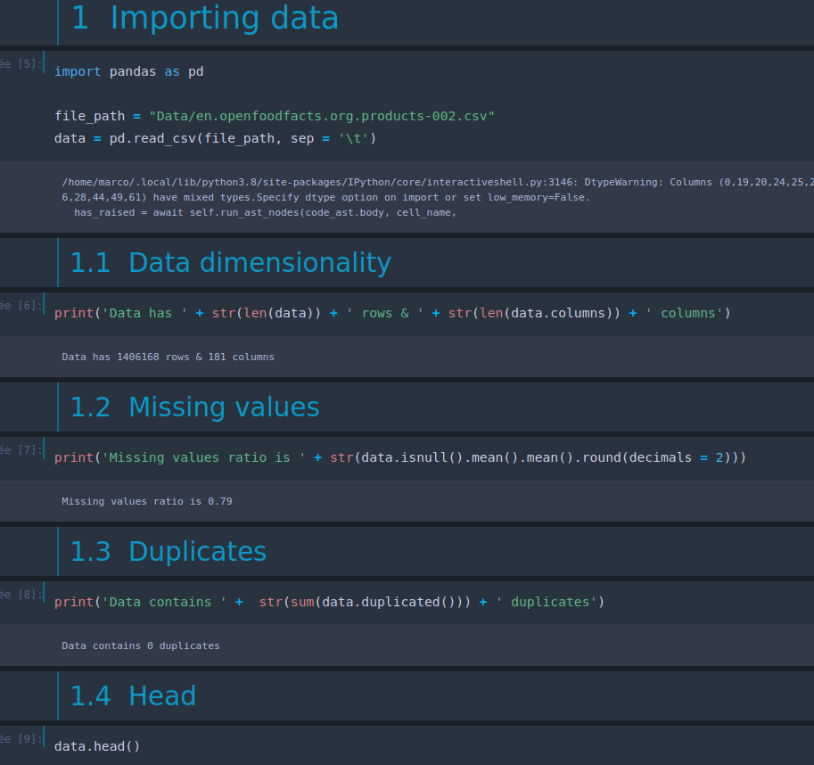
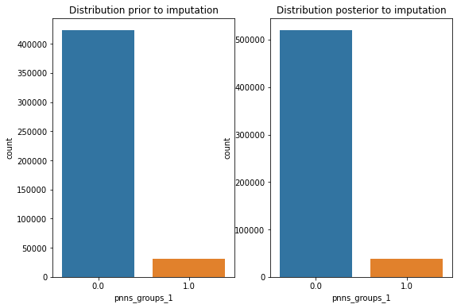

# Project : building a health app

## Project overview

* This project consists of evaluating the feasibility of an app that would return the nutriscore label from given features of a food product. It consists of a supervised multi-label classification task.

* The overall performance of the trained estimators is significantly positive and confirms the feasibility of such an app.
&nbsp;

## Workflow summary 	

* cleaned the product-related data from Open Food Facts database

* explored the data

* imputed missing values of relevant features with trained models on non-missing values

* realized statistical tests to figure whether nutriscore is a reliable indicator

* trained k-Nearest Neighbors classifier and predicted labels on test set 
&nbsp;

  

## Project installation

* use command pip install -r requirements.txt to install the dependencies

* the data is directly available [here](https://static.openfoodfacts.org/data/en.openfoodfacts.org.products.csv).  The csv file should be stored in a folder named Data to reproduce code in the cleaning notebook

* the cleaned data ready for exploration and modelling is available in the project repository under the name exploration_data.csv and may be read directly by the modelling notebook

&nbsp;

## Detailed workflow
&nbsp;

### Importing data
&nbsp;

&nbsp;

### Defining the project

This dataset contains information about food products.

* It contains:
    - labels
    - features : nutrients...

* The main goal of the project is to evaluate the feasibility of an application that would inform the consumer about the nutritional quality of a product

* This implies to train an underlying ML model that would predict nutriscore labels. The task here is a multilabel classification supervised task.

We will now clean the data as a first step

### Cleaning data

#### **Filtering on target missing values**

&nbsp;

Target features have almost 60% of Nans.

#### **Feature selection**

After this first cleaning step, we will now select the **relevant features** for our task.

We will focus on nutrients, which are the features most likely to impact nutriscore : 
  - the amount of energy in kcal
  - the quantity of saturated fats
  - the quantity of protein
  - the quantity of sugars
  - the amount of fibre
  - the quantity of salt
  - the quantity of fruit, vegetables, nuts
  - the category: solid or drink

#### **Missing values on filtered features**

&nbsp;

We see that some of these variables have extremely satisfactory fill rates, close to 100%. 
                
For variables that have missing values : 
- fibers: we will figure a way of imputing missing values
- vegetables & nuts : with 98% of NANs, we have no choice but to discard the feature

Redundant features : 
- energy & energy kcal : we'll keep the most fulfilled feature

#### **Missing values by sample**

&nbsp;

Some products have missing values on many features. We should delete them to avoid working with over imputed samples.

#### **Outliers**

&nbsp;

We can see from the table above that some values in the dataset are outliers. 
The maximums in the columns 'proteins', 'sugars', 'salt', 'saturated fats' and 'fibre' are impossible, as they are higher than 100g.

Also some minimums are negative and therefore inconsistent: those in the columns 'proteins', 'sugars' and 'fibre'. 

We can apply the following cleaning principle: 

- the sum of the nutrients should logically not exceed 100g per 100g of product

- similarly, the current state of scientific knowledge allows us to admit that the most caloric nutrient is fat, and that one gram of fat represents 9 kcal, or 37.6 kJ. We can therefore consider that a product should logically contain no more than 3,760 kJ of energy

- we should not see a value below zero for the different nutrients 

- product should meet the following condition : kJ >= 37,6 * fats + 16,7 * sugars + 16,7 * proteins + 8,4 * fibers

&nbsp;

Even thoughh there are statistical outliers in the distributions, maximum value on each feature does not exceed 100g which is reasonable. 

#### **Duplicates**

&nbsp;

Duplicated IDs values are aggregated:
- by median for quantitative features
- by most frequent for categorical ones

#### **Missing values imputation**

**Product category feature**

&nbsp;

Here we may keep pnns_groups_1 as product category feature. It contains less classes but better distributed. We see that the the most frequent class is the 'unknown' label.

We could transform this feature as binary 'food vs beverage' assuming that the nutrient quantities expected to be considered as healthy are not the same for food or beverages.

Then we could try predict the missing labels by training a classifier.

&nbsp;

The labels are unbalanced here. A model should be evaluated on a metric that takes into account the disproporion here, such as f1_score. This metric gives insights about the predictions on minority classes and therefore the overall performance of the model.
&nbsp;

#### **Training a model**

&nbsp;

The knn estimator performs much better on average than the Dummy Classifier on our test set, being more accurate at predicting the minority label ie 'beverages'.

We will therefore impute missing values with this model.
&nbsp;

#### **Control of the distributions**
&nbsp;

&nbsp;

The distributions before and after imputation are pretty much the same and are consistent with the performance of our model. The idea here is to avoid introducing some bias in the distributions.

**Fibers**

* Fibers has approximatively 40% of NAns
* As with 'pnns', we will try here to implement a model to predict missing values.
* The estimator will be RandomForest

&nbsp;

RandomForest reaches an r2 score of almost 0.7 on our test set, which is very satisfying here. 
We will therefore impute fiber missing values with this model.

#### **Control of the distributions**
&nbsp;

&nbsp;

&nbsp;

&nbsp;

### Exploration

Now that the cleaning has been done, we will produce some visualizations to get insights about the target and the features before modelling.

&nbsp;

Globally the distribution of the target labels can be considerered as unbalanced, considering  d class is overrepresented.

However the distribution between other classes is fairly balanced, and there is no minority class with very few samples.

Over or undersampling prior to classification will not be needed here.
&nbsp;

#### **Is nutriscore a good health indicator?**
&nbsp;

Before building a classifier we should check whether nutriscore may be considered a good health indicator. 

To answer this question : 

- we will test correlation between target and:
    - fibers (healthy)
    - saturated fat & sugars (not healthy)
    - correlation coefficient should be opposite

Two statistical tests could help us :

- **Pearson** which quantifies linear correalation between features
- **Spearman** as done above, which more generally quantifies monotonous relations

**Pearson** assumes continuous and normal distributions for the features to test.
We may then apply a Shapiro normality test to test whether our distributions are or not normal.

&nbsp;

Since distributions are not Gaussian we will take Spearman test between nutriscore and : 
- fibers
- saturated fat
- sugars

Assuming that fibers are good for health whereas saturated fat & sugars are bad, the correlation coefficient sign should be the opposite for fibers vs the rest.

&nbsp;

&nbsp;

&nbsp;

#### **Bivariate analysis**

&nbsp;

* The boxplots suggest that there is a dependency between the target and some of the features.
Products with 'e' grade tend to have higher quantities of saturated fat or sugars which is consistent with the correlation test done above.

* Since more than one feature seems to have predictive power, we must ensure they are not redundant, so each will help improve the model performance.

* One way is to visualize and interpret linear correlation between features with both PCA and correlation matrix.

* Pearson correlation as well as PCA assume Gaussian distribution which is not the case here. However, applying these tools here may help us to get better insight of our data.
&nbsp;

#### **PCA**

&nbsp;

The variables best represented on the first axis are the amount of energy and saturated fat (higher coefficients). 

Axis 1 : 
- saturated fat & energy explain most of the variance of the samples (higher coefficients on axis)
- the direction of both features is likely the same which suggests positive linear correlation between these features

The most contributing variables to axis 2 are 'proteins' and 'sugars'. The arrows point in the opposite direction this time and seem to show a negative correlation between these two variables. This is confirmed by the correlation coefficient between the two variables, equal to -0.29.
&nbsp;

### **Training a model : KNearestNeighbors**
&nbsp;

- estimator : now that nutriscore has proven to be a reliable indicator, we will train an optimized kNN classifier that returns the target based on the amounts of each nutrient present in the product. The goal here is to evaluate the feasibility of an app that would return nutriscore.

- metric : we will use accuracy (percentage of correct predictions) as evaluation metric for the optimization and the comparison with a dummy model. Since the distribution of the target is fairly balanced and there is no priority to focus on certain classes accuracy is a good choice. 

&nbsp;

The optimal n_neighbors parameter found by Grid is k = 5, with an accuracy score ~ 0.85.

kNN's performance is very superior to the DummyClassifier and consistent accross folds.

The features considered here are relevant here and enable training a robust classifier.
&nbsp;

#### **Predictions on test set**

&nbsp;

Performance on test set generalizes very well. Accuracy score on the test set is pretty much equal to the mean score on validation folds on the train set.

Let's see the confusion matrix to get better insights on predictions per class.
&nbsp;

**Confusion matrix**

&nbsp;

The confusion matrix confirms visually the overall performance of the model. 
All classes seem to be predicted accurately. 

Further analysis shows that better predicted classes are extreme classes A, D and E.
For E label we get recall = 0.9 and precision = 0.91.

Least performing classes are B and C.
&nbsp;

# Conclusion

* Our project of application is feasible. The good performance of the knn model confirms that we have the features necessary to train an accurate classifier.

* Beyond the overall performance of 85%, the model is efficient because the risk of a glaring error, i.e. of attributing a rating to a product that is quite far from its actual rating, is low.

* Further research could try to include new features such as vegetables quantity in food.
Also other estimators could be trained to improve the performance of the predictions.
&nbsp;

## The cleaning notebook is accessible [here](Cleaning_nb.ipynb) and the exploration & modelling notebook [here](Modelling_nb.ipynb)

 The modelling notebook can be run immediately. As for the cleaning notebook, raw data should be first downloaded from the given link in the Project installation section of this README

